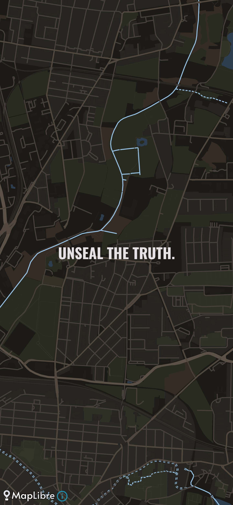
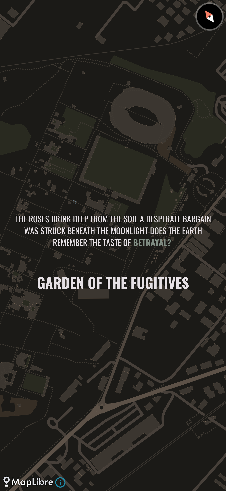

## Description

This Android app reimagines the iconic "Heart" from *Dishonored* as a real-world artifact. By using your device's location, it identifies the nearest landmark and channels a haunting, poetic narrative about that place-generated in real time using a large language model.
Built with Jetpack Compose, Hilt, and MapLibre, the app emphasizes gesture-driven interaction, atmospheric storytelling, and modular architecture for future expansion.

---

## Story

Inspired by the eerie intimacy of the Heart in *[Dishonored](https://en.wikipedia.org/wiki/Dishonored)*, this fun side project explores what it means to listen to a place.

In the opening of the 2012 action-adventure game *Dishonored*, Corvo Attano is offered a [mechanical heart](https://www.rockpapershotgun.com/the-gaming-pulse-on-dishonoreds-heart#more-135985) that helps him locate in-game artifacts such as *runes* and *bone charms*. But it has one more feature: when squeezed, it whispers stories about nearby locations and people.
So with that mechanic in mind, I developed an app that attempts to replicate its behavior in the real world. The UX is intentionally minimal, just tap anywhere on the screen, and the app works its magic to uncover the "lore" of the surrounding place.

---

## Preview


<div style="display: flex; justify-content: space-between;">
  
  
  
</div>


[](https://youtube.com/shorts/iheMolmcDSI)


---

## APIs Used

- **[Google Play Services Location](https://developer.android.com/training/location)**  
  For retrieving the device’s current location with high accuracy.

- **[Wikipedia API](https://www.mediawiki.org/wiki/API:Main_page)**  
  Used to fetch the nearest landmark or place of interest based on coordinates.

- **[OpenRouter API](https://openrouter.ai/docs)**  
  Generates atmospheric, lore-rich descriptions of nearby locations using a flexible LLM routing platform.

- **[MapLibre GL Android SDK](https://maplibre.org/projects/maplibre-gl-native/)**  
  Provides offline-friendly, customizable map rendering for visual
  
- **[Speechify API](https://speechify.com/developers/)**  
  Converts generated text into immersive, high-quality voice narration for in-app playback.

> ⚠️ **Note:** For production environments, you should avoid storing API keys (e.g., Speechify or OpenRouter) in `local.properties`. Even if excluded from version control, these keys are still visible in the compiled APK.  
> Instead, consider using a secure backend service or Firebase Cloud Functions to proxy sensitive requests.  
> This project uses local keys only for demo and proof-of-concept purposes.

## Tech Stack

### Core Frameworks & Language
- [Kotlin](https://kotlinlang.org/)
- [Android Gradle Plugin](https://developer.android.com/build/releases/gradle-plugin)
- [Jetpack Compose BOM](https://developer.android.com/compose)
- [Kotlin Symbol Processing (KSP)](https://kotlinlang.org/docs/ksp-overview.html)

### UI & UX
- [Jetpack Compose](https://developer.android.com/compose)
- [Material 3 & Adaptive Navigation Suite](https://developer.android.com/jetpack/compose/material3)
- [ConstraintLayout for Compose](https://developer.android.com/jetpack/compose/layouts/constraintlayout)
- [Google Fonts for Compose](https://developer.android.com/jetpack/compose/text/fonts)
- [AppCompat & Material Components](https://developer.android.com/jetpack/androidx/releases/appcompat)

### Dependency Injection
- [Hilt](https://developer.android.com/training/dependency-injection/hilt-android)

### Location & Mapping
- [Google Play Services Location](https://developer.android.com/training/location)
- [MapLibre Android SDK](https://docs.maptiler.com/maplibre-gl-native-android/)

### Networking & Serialization
- [Retrofit](https://square.github.io/retrofit/)
- [OkHttp](https://square.github.io/okhttp/)
- [Moshi](https://github.com/square/moshi)
- [Kotlinx Serialization](https://kotlinlang.org/docs/serialization.html)


### Persistence & Local Storage
- [Jetpack DataStore](https://developer.android.com/topic/libraries/architecture/datastore)

> 🛡️ **Security Note:** If storing location-based or generated lore locally, ensure sensitive data is encrypted or anonymized. Consider using `EncryptedDataStore` or a secure wrapper for any personally identifiable information (PII).


### Media Playback
- [Media3 ExoPlayer](https://developer.android.com/media/media3/exoplayer)

### Asynchronous & Background Tasks
- [Kotlin Coroutines](https://kotlinlang.org/docs/coroutines-overview.html)

---

## How to Run

To run the app locally, you’ll need to configure your API keys for voice and language generation.

### 1. Configure `local.properties`

Copy the provided `local.properties.example` file and rename it to `local.properties` in the root of your project. Then, add your API keys:

SPEECHIFY_API_KEY=YOUR_SPEECHIFY_API_KEY 

OPENROUTERAI_API_KEY=YOUR_OPENROUTERAI_API_KEY

These keys are required for:
- **Speechify**: Text-to-speech narration
- **OpenRouterAI**: Generating location-based lore using an LLM

> ⚠️ Do not commit your `local.properties` file to version control. It contains sensitive credentials.

### 2. Build & Run

You can now build and run the app using Android Studio or the command line:

```bash
./gradlew installDebug
